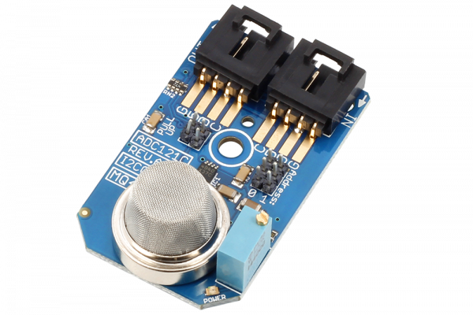

[](https://store.ncd.io/product/mq-4-methane-natural-gas-sensor-adc121c-12-bit-adc-i2c-mini-module/).

# ADC121C_MQ4
The MQ-4 is capable of sensing methane or natural gas air concentration levels between 200 to 10000ppm. The ideal sensing condition for the MQ4 is 20°C ±2°C at 65% ±5% humidity.
This Device is available from www.ncd.io 

[SKU: ADC121C_MQ4_I2CS]

(https://store.ncd.io/product/mq-4-methane-natural-gas-sensor-adc121c-12-bit-adc-i2c-mini-module/)
This Sample code can be used with Raspberry Pi.

Hardware needed to interface ADC121C_MQ4 Sensor With Raspberry Pi : 

1. <a href="https://store.ncd.io/product/mq-4-methane-natural-gas-sensor-adc121c-12-bit-adc-i2c-mini-module/">ADC121C_MQ4 Methane Gas Sensor</a>

2. <a href="https://store.ncd.io/product/i2c-shield-for-raspberry-pi-3-pi2-with-outward-facing-i2c-port-terminates-over-hdmi-port/">Raspberry Pi I2C Shield</a>

3. <a href="https://store.ncd.io/product/i%C2%B2c-cable/">I2C Cable</a>

## Python

Download and install smbus library on Raspberry pi. Steps to install smbus are provided at:

https://pypi.python.org/pypi/smbus-cffi/0.5.1
Download (or git pull) the code in pi. Run the program.

```cpp

$> python ADC121C_MQ4.py

```

The lib is a sample library, you will need to calibrate the sensor according to your application requirement.
